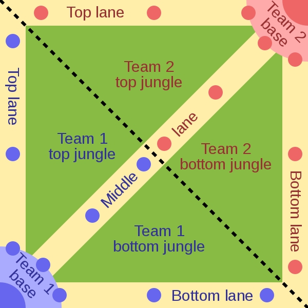

---
output:
  pdf_document: default
  html_document: default
---

# Understanding League of Legends: What makes a team win a game?

**Author:** Lena Schwertmann

**Course:** Software for Analyzing Data

## 1 What is the game about?

League of Legends is multiplayer online battle arena (MOBA) game that exists since 2009 and is played across the globe.
Players play on different servers according to the region they live in.
The major regions also have competitive championship series whose winners move on to the yearly world championship.
The data from the 2019 championship series is analyzed in this report to judge in a data-driven way which statistics from the dataset best predict the win or lose of a team.

So what are the most important facts and terms to know about the game?
The game is played in two teams of five people each. The game is played on the Summoner's Rift map that is split into the blue and the red side. Each team has a nexus in their homebase protected by three towers. If that nexus is destroyed, the team loses.
The games are relatively short; for this dataset the mean duration is ca. 33 +/- 6 min.
As shown in a stylized representation of the map in figure 1 ([source here](https://commons.wikimedia.org/wiki/File:Map_of_MOBA.svg), accessed 2020-29-02), the remaining area of the map is split into the jungle and three lanes.
Usually, four players are located on the lanes while one player roams in the jungle.
In the lanes, vision is clear and the players are protected by their towers. 
They consistently kill the opponent's minions to obtain gold and try killing their opponents without getting killed.
The player in the jungle fights different monsters that give her special abilities and gold.
Two large monsters, the dragon and the baron, usually require multiple players to kill, offering more rewards.
Walking through the jungle can be dangerous, as other players can hide in bushes and are thus invisible.
To avoid surprise-deaths, players place so-called wards which are items that grant vision over a small area for a limited time.
Back in the homebase, the players can buy other items, e.g. weapons, to boost the strength and abilities of the champion they play.
In order to win, the players must thus control the map, destroy the opponents towers, perform well in team fights and obtain enough gold to purchase useful items while protecting their own base.
A visually appealing introduction to the game can be found [here](https://euw.leagueoflegends.com/en-gb/how-to-play/).

```{r pressure, fig.align = 'center', echo=FALSE, fig.cap="Stylized representation of the Summoner's Rift map in League of Legends where two teams of five people play to destroy the opponent's nexus in the base. The map is divided into 3 lanes and the jungle. The round dots depict turrets that auto-fire on opponents within their range.", out.width = '30%'}
# include simplified summoners rift map

```


## 2 Setting Up R

**How to run this code**: 

1. Below, set your working directory

2. Copy the data files to your working directory

3. If necessary, install the required packages that are loaded below

```{r message=FALSE, warning=FALSE}
library(rmarkdown)    # for using RMarkdown
library(tidyverse)    # for tidying and cleaning data
library(magrittr)     # for additional pipe operators
library(readxl)       # for reading in Excel files as tibbles
library(modelr)       # for saving formulas for glm in a handy way
library(car)          # for model diagnostics

library(ggfortify)    # for more plotting options in ggplot, e.g. PCA objects
library(ggplot2)      # for advanced plotting based on tidyverse
library(GGally)       # for nice heatmap plots of correlation matrix
```

```{r results='hide'}
# set working directory

#setwd("enter desired path here")

# check
getwd()
```


## 2 Data Import

The dataset is obtained from Oracle's Elixir which is a website maintained by Tim Sevenhuysen that provides eSports statistics for League of Legends.
The data comprises of the competitive matches from the spring and summer season in 2019, not including the world championships.
The data is accessible [here](https://oracleselixir.com/match-data/).

All variables are imported as character columns as this avoids parsing problems from the Excel file to R.
In the next step, the correct data types are assigned.

```{r results='hide', message=FALSE, warning=FALSE}
### import data file from Oracle's elixir from 2019
# spring season
league2019spring <-read_excel("2019-spring-match-data-OraclesElixir-2019-05-21.xlsx", col_types = "text")
class(league2019spring) # tibble
# summer season
league2019summer <- read_excel("2019-summer-match-data-OraclesElixir-2019-09-16.xlsx", col_types = "text")

# combine the two datasets
league2019 <- full_join(league2019spring, league2019summer)
glimpse(league2019) # 25,476 rows, 98 variables
```

The variables are either coerced to categorical factor or continuous, double-precision variables following the accompanying data dictionary by Oracle's Elixir ([link here](https://oracleselixir.com/match-data/match-data-dictionary/)).
The only variables that remain characters are variables that are not interesting for the modelling part such as the game ID and player (= player name).

```{r results='hide'}
### make data types meaningful + drop unnecessary columns
# coerce the variables into meaningful data types
league2019_new <- league2019 %>%
  select(-url, -date) %>% # remove some columns
  mutate_at(vars(league, split, week, game, playerid, side, position,
                 team, champion, ban1, ban2, ban3, ban4, ban5, patchno,
                 result, fb, fbassist, fbvictim, fd, herald, ft,
                 firstmidouter, firsttothreetowers, fbaron), factor) %>%
  mutate_at(vars(gamelength, k, d, a, teamkills, teamdeaths, doubles, triples,
                 quadras, pentas, fbtime, okpm, kpm, ckpm, fdtime, teamdragkills, 
                 oppelementals, oppdragkills, elementals, firedrakes, waterdrakes, 
                 earthdrakes, airdrakes, elders, oppelders, heraldtime, fttime,
                 teamtowerkills,opptowerkills, fbarontime:csdat15), as.double)

### identifying the NAs introduced by coercion
# NAs by coercion for okpm
okpm_NA <- which(is.na(league2019_new$okpm))
okpm_NA
length(okpm_NA) #22
league2019$okpm[okpm_NA] # division by 0 error!
# NAs by coercion for kpm
kpm_NA <- which(is.na(league2019_new$kpm))
kpm_NA
length(kpm_NA) # 22 
league2019$kpm[kpm_NA] # division by 0 error!
# NAs by coercion for ckpm
ckpm_NA <- which(is.na(league2019_new$ckpm))
ckpm_NA
length(ckpm_NA) # 24
league2019$ckpm[ckpm_NA] # division by 0 error!

# What happens in these rows overall? Is there some pattern to it?
league2019_new[ckpm_NA,]
# yes, they are from two games in the LPL

league2019 <- league2019_new
rm(league2019_new) # remove temporary variable to avoid confusion later on
glimpse(league2019)
```

## 3 Data Cleaning

This part is concerned with identifying missing values (NAs) in the data set, identifying patterns in missing values and then making informed decisions to decide how to deal with them. 
Before taking a detailed look at the missing values (NAs), three tournaments are excluded from the analyis.
Visiting the current League of Legends eSports section ([source here](https://eu.lolesports.com/en/leagues)) shows what the main regional leagues are:

1. LEC (League of Legends European Championship): Europe

2. LCS (League of Legends Championship Series): North America (USA, Canada) 

3. LCK (League of Legends Champions Korea): South Korea

4. LPL (Tencent League of Legends Pro League): China

5. LMS (League of Legends Master Series): Taiwan, Hong Kong, Macau

The variable \texttt{league} has two additional levels: MSI (mid-season invitational) and CBLoL (Campeonato Brasileiro de League of Legends).
As these two tournaments do not belong to the premier leagues they are excluded from the following analyis.


```{r results='hide'}
# exclude MSI and CBLo
filter(league2019, league == "CBLoL") # 2316 rows
filter(league2019, league == "MSI") # 948 rows

league2019 <- league2019 %>%
  filter(league != "CBLoL" & league != "MSI") # 22,212 rows remain
```

The dataset contains statistics at player-level and at team level.
Team-level rows are indicated by "Team" as the player name and position as well as 100 and 200 as the respective player ID.
Some variables provide data only on team or player level respectively.
Therefore, in order to differ between systematic (explainable) and non-systematic (random, data is really missing) NAs, the dataset is split up in the following.

```{r results='hide', message=FALSE, warning=FALSE}
### analyze systematics of NAs
team_NA <- league2019 %>%
  filter(player == "Team") %>%
  summarise_all(funs(sum(is.na(.)))) %>%
  add_column(subset = "team", .before = 1)

player_NA <- league2019 %>%
  filter(player != "Team") %>%
  summarise_all(funs(sum(is.na(.)))) %>%
  add_column(subset = "player", .before = 1)

NA_count <- full_join(team_NA, player_NA)
NA_count

dim(filter(league2019, player == "Team")) # 3702 rows
# Which variables do not exist at team level?
# earnedgoldshare, dmgshare, doubles, triples, quadras, pentas, champions

dim(filter(league2019, player != "Team")) # 18510 rows
# the gold + cs statistics are missing for many games
# team = 1270 times, player = 6350 times

league2019 %>%
  filter(is.na(csat15) == TRUE) %>%
  count(league)
# LPL is mostly responsible for the NAs!

league2019 %>% 
  count(league)
# LPL has overall 7608 data points, some variable values are completely missing!

# conclusion: exclude LPL
league2019 <- league2019 %>%
  filter(league != "LPL")
# leaves 14,604 rows

team_NA_final <- league2019 %>%
  filter(player == "Team") %>%
  summarise_all(funs(sum(is.na(.)))) %>%
  add_column(subset = "team", .before = 1)

player_NA_final <- league2019 %>%
  filter(player != "Team") %>%
  summarise_all(funs(sum(is.na(.)))) %>%
  add_column(subset = "player", .before = 1)

NA_count_final <- full_join(team_NA_final, player_NA_final) 
NA_count_final
  
# other variables leaft with many NAs?
# heraldtime, fbaron, fbarontime, visiblewardclearrate, invisiblewardclearrate

# remove variables with >20 NAs and remove rows  with few NAs
league2019 <- league2019 %>%
  select(everything(), -herald, -heraldtime, -fbaron, -fbarontime,
         -visiblewardclearrate, -invisiblewardclearrate) %>%
  filter(is.na(ban5) == FALSE & is.na(ban4) == FALSE & is.na(ban3) == FALSE) %>%
  filter(is.na(fb) == FALSE)
# leaves 14,526 rows and 90 variables

# no NAs (except systematic ones on team level) remain
league2019 %>%
  summarise_all(funs(sum(is.na(.))))
```

The analysis above shows that the systematic NAs are for once due to some variables (earnedgoldshare, dmgshare, doubles, triples, quadras, pentas, champions) only existing at player and not at team level.
Another kind of systematic identified are that the games of the Chinese LPL league lacked entries for the majority of the variables.
The LPL league is thus excluded from the analysis which reduces the dataset by 7608 rows.
Beyond that, a few variables with many NAs and some rows with NAs across variables were removed, leaving 14,526 rows and 90 variables.

Due to the large amount of variables they can not be explained one-by-one here. The reader is referred to the consistent data dictionary accompanying the original data ([source](https://oracleselixir.com/match-data/match-data-dictionary/)).
In the following, variables are only discussed and explained in detail when they play a relevant role for the question at hand.

## 4 Data Exploration - What are interesting observations?

### What is the relationship between the variables? Are they different at player level than at team level?

The relationship between the variables is examined using the pariwise Pearson correlation that calculates a value in the interval [-1,+1].
As the Pearson correlation is only meaningful for continuous variables, the 25 factor variabes are not included in this analysis.
A positive correlation value indicate that if the value of one variable increases, so does the other one.
If the values of the two variables grow in opposite directions (one increases, the other decreases) the correlation is negative.

```{r results = 'hide', fig.keep = 'all', fig.show = 'hold', dev = 'pdf', fig.align = 'center', out.width = '\\maxwidth', fig.cap = 'Pearson correlation between the continuous variables for the League of Legends data from competitive matches in 2019. Data is filtered at individual player and at team level to show the different behavior.'}
# correlation of continuous variables at player level
data_cor_mat_player <- league2019 %>%
    filter(player != "Team") %>%
    select(gamelength, k, d, a, teamkills, teamdeaths,
                             doubles, triples, quadras, pentas, fbtime, okpm, kpm, ckpm,
                             fdtime, teamdragkills, oppelementals, oppdragkills,
                             elementals, firedrakes, waterdrakes, earthdrakes, airdrakes,
                             elders, oppelders,  fttime, teamtowerkills:csdat15)

# correlation of continuous variables at team level
data_cor_mat_team <- league2019 %>%
    filter(player == "Team") %>%
    select(gamelength, k, d, a, teamkills, teamdeaths, fbtime, okpm, kpm, ckpm,fdtime,
           teamdragkills, oppelementals, oppdragkills, elementals, firedrakes,
           waterdrakes, earthdrakes, airdrakes, elders, oppelders,  fttime,
           teamtowerkills:csdat15) %>%
    select(-dmgshare, -earnedgoldshare, -wardshare)

cor_mat_player <- cor(data_cor_mat_player, method = "pearson")
cor_mat_team <- cor(data_cor_mat_team, method = "pearson")

# plot a heatmap from correlation values
ggcorr(data = NULL, cor_matrix = cor_mat_player, label = FALSE,
       size = 2, hjust = 1, layout.exp = 13, name = "Pearson Correlation",
       low = 'darkred',  mid = 'white', high = 'darkgreen',
       legend.position = "right", legend.size = 9) +
  ggtitle("Player Level") + 
  theme(plot.title = element_text(vjust = -25, hjust = 0.25))

# team level
ggcorr(data = NULL, cor_matrix = cor_mat_team, label = FALSE,
       size = 2, hjust = 1, layout.exp = 13, name = "Pearson Correlation",
       low = 'darkred',  mid = 'white', high = 'darkgreen',
       legend.position = "none", legend.size = 9) +
  ggtitle("Team Level") + 
  theme(plot.title = element_text(vjust = -25, hjust = 0.25))
```


The correlation plots in figure 2 reveal fundamental patterns in the logic of the game both at player and team level in a data-driven way. 
The correlation matrix at team level has slightly different dimensions as some variables only exist at player and not at team level (doubles, triples, quadras, pentas, earnedgoldshare, dmgshare).
Also the wardshare is always equal to 1 at team levele and thus also excluded.
Due to the large amount of variables, only some connections are going to be analyzed.
To make it clear: The information whether a game was won or lost (variable result) does not appear directly in the plot as categorical variables are not included.
Despite that, some variables are quite clear indicators of a win or a loss, such as k, d and a (= kills, deaths and assists) and all variables involving gold (e.g. goldshare or gdat15 = gold at minute 15)
Usually killing many opponents, assisting in killing them and dying as seldom as possible is helpful for winning as kills and assists are rewarded with gold. 

For following the points made about specific observations is it recommended to search for them in the PDF file of this report. The variable names as they appear in figure 2 are always mentioned alongside lengthier explanation of the variable.

What can first be noted is that both at player and team level, a lot of strong correlations exists, indicating a lot of redundancy in the exlanatory variables.
Those strong correlations reflect logical tendencies that one would expect knowing the meaning of the respective variables.
For instance, the kills per minute (kpm) have a near-perfect positive correlation with the kills (k), as the value for kills per minute is logically higher for more kills.
Also the number of towers destroyed (teamtowerkills) correlates clearly negatively with the number of towers destroyed by the opponents (opptowerkills).
This represents the tendency in the game that usually the team being successful in destroying the opponent's towers is also successful in keeping their towers intact.
Also, usually all towers of the losing team are destroyed at the end of the game, resulting in a high value for that variable for one of the teams.

The overview over both plots shows noticeable differences between the player and the team level.
Overall, the pattern at player level is more distinct than at the team level.
This is probably due to the fact that more fine-grained information is lost when information is aggregated at team level.
For instance, the five players have quite different roles. So within an observation of a single player it is logical that the players statistics revolving around the gold they earned (totalgold, earnedgpm) correlates strongly with other gold-related variables such as the amount of gold spent (goldspent).
Also, the variables measuring gold, experience points (xp) and the creep score (cs = total number of minions killed) 10 or 15 min into the game (they end with "...at10", "...at15") are responsible for the well-visible patterns in the upper triangle of the correlation plot at player level.
These patterns show the multiple redundancies in the data, for example having a lot of gold, many experience points and a high creep score (be it at minute 10 or 15) correlates to a high damage dealt to champions (dmgtochamps), a high amount of gold spent (goldspent).
Also it becomes clear that wards used for vision control on the map cost money, because the ward-related variables (e.g. the number of wards placed, wards) correlate negatively with all gold-related variables.

At the team level, these relationships get diffused, because the information from five different players is thrown together and aggregated.
At team level, the information from different is averaged between players e.g. earning a lot/very little gold or dealing a lot/very little damage due to different roles in the team.
In contrast to that, other correlations become more interesting and clear at team level, e.g. positive correlations of gold-related variables with the game length (gamelength) and a negative correlation between the number of towers destroyed by the opponent (opptowerkills) and the gold earned per minute (earnedgpm).

Not all observations from figure 2 can be explained in detail here, showing the richness of such a simple plot.

## 5 Statistical Modeling - Why does a team win?

Further information about the mechanics and logics of the game with respect to their significance for the win or loss of a game can be extracted using statistical modeling.
For that purpose, only statistics at team level are considered, as the relationships between many different variables were more clearer there.
The binary variable "result" indicates whether the game was won or lost and thus constitutes the response variable that is to be modeled.
For modeling a generalized linear model (GLM) is chosen as the explanatory variables are both continuous and categorical and a non-normal, binomial error structure is assumed.
In the beginning, it is attempted to fit a model using all explanatory variables.
Continuous variables are scaled and centered. 

```{r fig.keep = 'none', results = 'hide', warning = FALSE}
# do GLM at team level
league2019_glm_all <- league2019 %>%
  filter(player == "Team") %>%
  select(-doubles:-pentas, -dmgshare, -earnedgoldshare,
         -wardshare, -champion) %>% # exclude player-level variables
  select(-player, -gameid, -team, -ban1:-ban5, -position) %>% # exclude redundant variables
  select(-split, -week, -game, -patchno, -playerid)  %>% # exclude meta data about games
  mutate_at(vars(gamelength, k, d, a, teamkills, teamdeaths, fbtime, 
                 okpm, kpm, ckpm, fdtime, teamdragkills, 
                 oppelementals, oppdragkills, elementals, firedrakes, waterdrakes, 
                 earthdrakes, airdrakes, elders, oppelders, fttime,
                 teamtowerkills:csdat15), scale)  
  
glm_all <- glm(result ~ ., data = league2019_glm_all,
               family = binomial(link = "logit"),
               maxit = 1000) #  force convergence with maxit
# error: glm.fit: fitted probabilities numerically 0 or 1 occurred
summary(glm_all)
```

The above model does not have a meaningful result (see results in .Rmd file) and must be forced to convergence after 1000 iterations.
In lack of a more suitable, data-driven approach for variable selection (also called dimensionality reduction), the variables are selected based on the observations made in figure 2 and some practical considerations.

In order to drop many variables at once, most of the time-related variables are dropped (variables ending with "...at10" or "...at15", as well as "...perminute" or "...pm").
Also, only the basic variables describing the objectives that result in rewards (dragon, baron, towers, minions and monsters) are included. 
Additionally general game metadata (e.g. the League), information about gold, damage dealt and vision controls (e.g. How many wards were placed?) are considered as important for predicting the result.

```{r fig.keep = 'none', results = 'hide', warning = FALSE}
# model simplification by manually selecting a subset of variables
league2019_glm_minimum <- league2019_glm_all %>%
  select(result, league, side, gamelength,               # general game info
         k, d, a, fb, kpm, okpm,                         # kill and death statistics
         fd, teamdragkills, oppdragkills,                # dragon
         ft, teamtowerkills, opptowerkills,              # towers
         teambaronkills, oppbaronkills,                  # baron
         dmgtochamps, wards, wcpm,                       # damage and vision control
         totalgold, gspd,                                # gold variables
         minionkills, monsterkills)                      # minions + monsters      

# reduced to 25 variables and normalized the contiuous variables
glm_minimum <- glm(result ~ ., family = binomial,
                   data = league2019_glm_minimum)
# no convergence problems
# error: glm.fit: fitted probabilities numerically 0 or 1 occurred

# summary
summary(glm_minimum) # AIC: 119.09
# plot
plot(glm_minimum)
hist(glm_minimum$residuals, breaks = 1000,
     xlim = c(-2,2))
# vif
vif(glm_minimum) # looks ok (>4) for most variables
# exceptions: gamelength, k, d, kpm, okpm, totalgold, minionkills
```

The resulting model shows no convergence problems and acceptable variance inflation factors for most of the variables.
Furthermore, the results of this first minimal model (refer to `summary(glm_minimum)` in the .Rmd file) show that the deviance could be reduced considerably from ca. 3356 to 65.
Also the results do not indicate any overdispersion, as the residual deviance is smaller than the degrees of freedom (see Crawley, M. (2013): The R Book, Chapter 16+17).
The most significant variables are the game length, the fact that the teamed obtained the first kill in the game (= "first blook", variable: fb), the number of tower kills, the total gold amount and the gold spent percentage difference (gspd).
The step function is used to further reduce the number of variables based on these observations, resulting in the final model.

```{r fig.keep = 'none', results = 'hide', warning = FALSE}
glm_minimum_reduced <- step(glm_minimum) 

summary(glm_minimum_reduced) # AIC 99.932, lower than before!

final_formula <- result ~ gamelength + d + fb + fd + teamtowerkills + opptowerkills + 
    teambaronkills + dmgtochamps + wards + totalgold + gspd + 
    minionkills + monsterkills
```

The reduced models leaves 11 variables that are significant to some degree and lowers the AIC to 99.932 (before: 119.09) indicating a considerable improvement with respect to simplifying the model while retaining its predictive power (refer to `summary(glm_minimum_reduced)`).
The estimates for the coefficients of the model show what is important for a team to have a high probability of winning the game:
A relatively short game (gamelength), a low number of deaths (d), not being the team making the first kill (fb), destroying many turrets (teamtowerkills), keeping their own turrets from getting destroyed (opptowerkills), not trying to kill the baron often (teambaronkills), earning a high amount of gold (totalgold) and having spent less gold than the opponents at the end of the game (gspd).

## 6 Conclusion

Using relatively simple exploratory and modeling tools it was possible to identify some of the logic underlying the game League of Legends using the statistics from the international competitive matches from 2019.
The statistics show a high redundancy in the continuous variables that is addressed by manually selecting only a few variables for modeling the factors that are most significant for winning a game using a generalized linear model.
Reducing the number of variables in a systematic way remains an open challenge to be pursued further.


